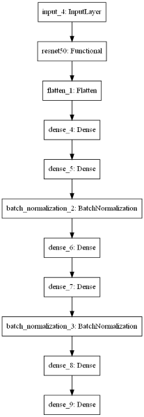
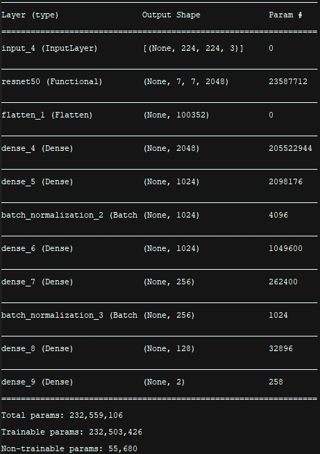
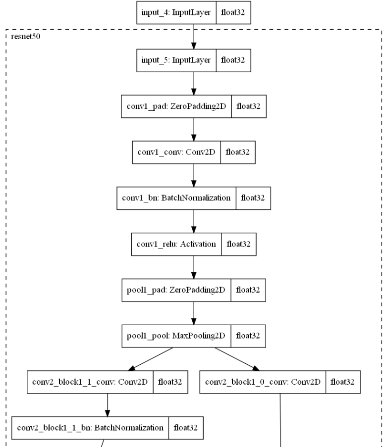
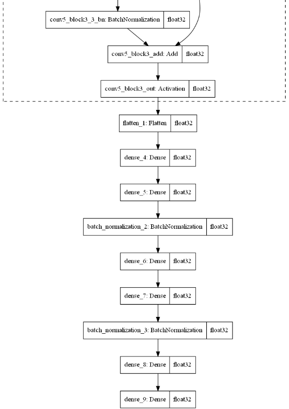

# WAMDA reproduction

## Background

# Introduction

With this blog post, we wish to discuss our recent experience in attempting to implement the research paper titled "WAMDA: Weighted Alignment of Sources for Multi-source Domain Adaptation" by
S.Aggarwal, J.Nath Kundu, R.Venkatesh Babu and A. Chakraborty at the Department of Computational and Data Sciences (CDS) of the Indian Institute of Science in Bangalore, India.

## Learning \& The Distribution of Data

The common underlying assumption of essentially all, renowned or not, supervised and semi-supervised deep learning algorithms, is that of the data at hand being Independently and Identicainglly
Distributed, (IID). More specifically, the assumption is that training data and testing data are both drawn from a single common distribution. Consequently, when there are changes in distribution of
data, it becomes necessary for statistical models to be reconstructed from the distribution of the new data. Often times, the process of doing so proves to be challenging, due to, for instance, having
to invest a significant amount of time to laborious manual data curation and processing. In some cases, it may even be impossible to do so. In light of this, it became necessary to develop alternative
approaches which reduce, or all together eliminate, the need and the effort required for obtaining new labeled data, by exploiting the data that is already available and related. This has given rise
to a new class of machine learning algorithms, called _transfer learning_.

## Transfer Learning in Computer Vision

Transfer learning (TL) refers to the transferring of information from one machine learning task to another. For example, in multi-task learning, a single model solves mul-tiple tasks, such as a deep
model that has different output nodes for different tasks. Transfer learning mightinvolve transferring knowledge from the solution of a simpler task to a more complex one, or involve transferring
knowledge from a task where there is more data to one where there is less data.

In the case of computer vision, many _pre-trained models_ (usually trained on the ImageNet dataset) are publicly available for download and can be used to bootstrap powerful vision models out of very
little data. A pre-trained model is a saved network that was previously trained on a large dataset. In computer vision, this is typically on large-scale image-classification task. The spatial
hierarchy of features learned by a pre-trained network can effectively act as an abstract model for some visual domain, and hence such features can prove to be very useful. One of the ways in which a
pre-trained model can be used is for _feature extraction_.

### Feature Extraction with a Pretrained Network/Model

Feature extraction consists of using the representations learned by a previous network to extract interesting features from new samples. These features are then run through a new classifier, which is
trained from scratch. Generally, basic CNNs used for image classification comprise two parts:

- "Convolutional base of the model": A series of pooling and convolution layers.
- "Densely connected classifier": A fully-connected dense layer for classification.

 Constituent components of a
generic CNN network employed in computer vision Convolutional NeuralNetwork | Deep Learning by Swapna K E

**TO BE COMPLETED**

### Domain Adaption

The scenario in which, learning, from a source domain data (distribution), is carried out by a model as to then be able to perform well in adapting to an (unseen/unknown) target domain
data (distribution) which is unlabelled (unsupervised learning). This "adaptation" of a source domain data trained model to target domain data is essentially the transferal of discriminative knowledge
learned by the source domain data trained model.

DA enables the learning of a mapping function, h, between (different) domains. When the target domain is unlabelled, the scenario is then what is called Unsupervised Domain Adaptation.

## Paper approach:

The paper proposes an approach split into **two major sections**, which themselves involve a number of steps.

The first stage is referred to as **pre-adaptation training**, and has for goal to obtain the relevance scores and "learn the discriminative knowledge inherently present in each source.

The second stage is the **WAMDA model** training itself. A weighted alignment of domains is performed, and a classifier is learned over this weighted aligned space.

The architectures and training for both stages is described bellow.

## **Pre-adaptation Learning**

The pre-adaptation phase itself is made up of **three distinct steps**, each responsible for training different sets of weights and seeking different outcomes. These three steps need to be **performed on every domain** of the dataset used, and have for final objective to obtain **tuned weights for the Source Feature Extractor layers** and **source relevance scores** (both necessary for the WAMDA model).

Three different layer sets are necessary for this section, and their respective architectures are described bellow:

**Source Feature Extractor: F_S_i**
- ImageNet pre-trained ResNet-50 till average pool layer
- Linear FC (2048, 1024) + ELU
- Linear FC (1024, 1024) + BatchNorm + ELU
- Linear FC (1024, f_dim) + ELU
- Linear FC (f_dim, f_dim) + BatchNorm + ELU

**Source Feature Extractor adaptor: Q_S_i**
- Linear FC (f_dim, n_classes)

**Domain classifier: D_S_i**
- Linear FC (f_dim, f_dim/2) + ELU + Linear FC (f_dim/2, 2)

Here, f_dim refers to the dimensionality of source feature space and  n_classes refers to the number of classes

**!!! Each of the steps described bellow need to be repeated for every distinct domains !!!**

### 1. Training F_S_i - D_S_i:
The F_S_i - D_S_i step is necessary for training the F_S_i weights. The F_S_i layer set itself is responsible for performing the feature extraction employed in subsequent steps. The Q_S_i layer is there to simply act as an adaptor to allow for multi-class training and predictions to be performed.

The following training settings were applied:
An Image generator was created to load images in during training. The rescale factor was set to 1./255, and a validation split of 0.2 was selected. The following data augmentations settings were adopted:

- rotation_range=20,
- width_shift_range=0.2
- height_shift_range=0.2
- shear_range=0.2
- zoom_range=0.2
- horizontal_flip=True
- target_size=(224, 224)

Each model was trained for a total of 100 epochs, and a batch size of 32 was opted for. The learning rate was set to 0.0001 and the optimiser used was adam as prescribed in the paper. Finally, a categorical crossentropy loss was used.

### 2. Training F_S_i - D_S_i:
Upon completion of the first step, the F_S_i layers are frozen, and the Q_S_i layer is swapped out for the D_S_i layers.

 

 

 

 

-> todo: XAVIER - explain training process/parameters adopted
-> todo: XAVIER - insert model summary

### 3. Obtaining source relevance scores using F_S_i - D_S_i:
Upon successfuly training the F_S_i - D_S_i, the D_S_i layers are finally frozen and an inference step is undertaken. The output of the model is then used in the equation shown below to obtain the source relevance scores which are recorded for subsequent use.

## **WAMDA**

Upon completing the pre-adaption phase and collected all necessary output, the WAMDA model can finaly be trained. The training itself is again done in **two distinct parts**, each to be **applied to each domains** respectively.
A total of four different layer sets are required for the WAMDA model, and are structured as follow:

**Source feature extractor: F_S_i**
The F_S_i architecture remains the same as in the pre-adaptation phase. The source-specific weights obtained from the pre-adaptation phase are used here and the layer set is kept frozen throughout the WAMDA traing process.

**E_S_i architecture:**
-  Linear FC (f_dim, 1024) + BatchNorm + ELU
-  Linear FC (1024, 1024) + BatchNorm + ELU
-  Linear FC (1024, c_dim) + BatchNorm + ELU
-  Linear FC (c_dim, c_dim) + BatchNorm + ELU

Here, c_dim refers to the dimensionality of target features.

**E_T architecture:**
- ImageNet pre-trained ResNet-50 till average pool layer
- Linear FC (2048, 1024) + ELU
- Linear FC (1024, 1024) + BatchNorm + ELU
- Linear FC (1024, c_dim) + BatchNorm + ELU
- Linear FC (c_dim, c_dim) + BatchNorm + ELU

Note: For the Office31 dataset used in this reproduction attempt, the ResNet-50 backbone of E_T is kept constant as specified in the supplementary material.

**Weighted aligned classifier: Q_T architecture:**
Linear F-C (c_dim, c_dim) + ELU + Linear FC (c_dim, n_classes)

The WAMDA model itself is trained in two distinct steps. The first one is employed to learn the Weighted Aligned Spaces, and the second to perform Target Specific Learning.

### 1. Weighted Aligned Spaces Learning:
This is achieved through **alternatively** minimising the **per-source cross-entropy weighted by source importance loss (L_qt)** and the **weighted domain alignment loss (L_align)**. With the exception of F_S_i, all other layers of the WAMDA model are adjusted here.

-> todo insert L_qt equation
-> todo insert L_align equation

Each loss was trained using loss-specific optimisers; **per-source cross-entropy loss** for L_qt and **Deep CORAL (L_coral)** for L_align.

A number of limitations and unknows were found for this part, including undefined parameters and unknown variables. These are highlighted in the figure bellow:

### 2. Target Specific Learning:
The Target Specific Learning is also made up of **two alternating parts** during training. The only layers updated in this step are the ones contained in E_T.

The first part is referred to as Distillation and Entropy Minimization, and uses the **distill-entropy loss (L_de)**, itself made up of a **distillation loss (L_distill)** and an **entropy constraint (L_entropy)** to make the target encoder E_T discriminative.

The second part, refered to a Guidance from Source Weighted Aligned Spaces, the **target to weighted aligned space loss (L_T->W)** is used to guide the target's projection onto the weighted aligned space.

This aspect of the architecture is the most complex encountered, and as a result also presents a number of gaps, such as hyperparameters and functions left out of the original paper. These are again highlighted in the figure bellow:

## Reproduction attempt and Results
->: XAVIER - todo specify our implementation details (python version/ tensor flow/ dataset)
->: XAVIER - todo describe/explain results of reproduction

## Conclusion
->: XAVIER - todo add reproduction attempt conclusion

